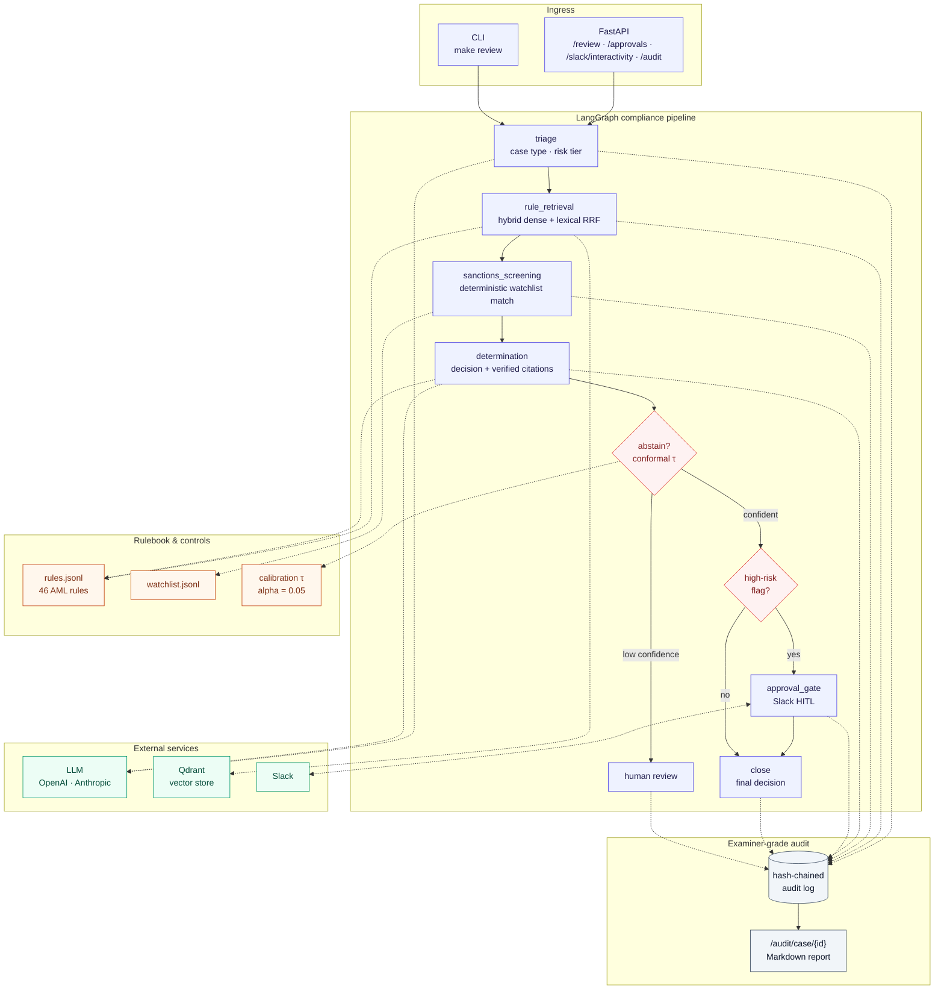
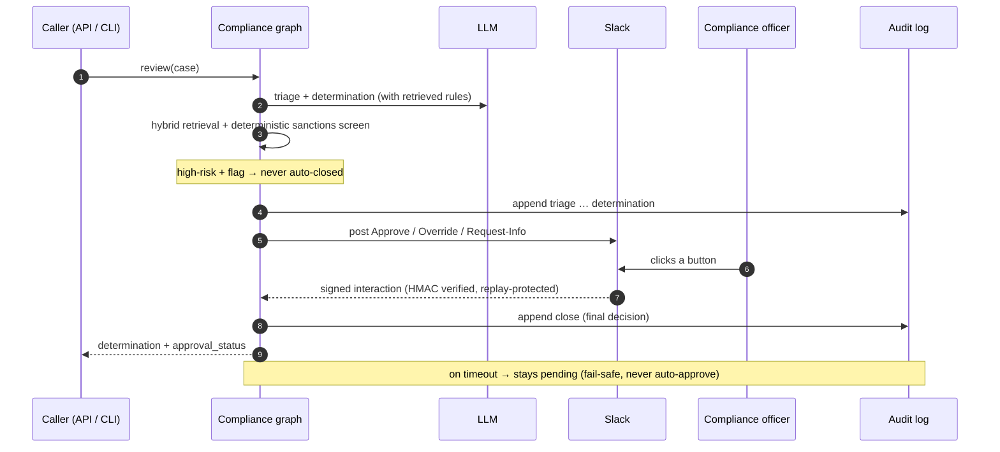

# fsi-compliance-agent

> A compliance-review agent that **cites the rule, knows when to abstain, and refuses
> to auto-close a high-risk flag without a human** — built around the one error that
> actually costs money in compliance: the missed flag. Built by someone who spent 11
> years in regulated financial services, and built to survive an examiner reading the
> audit log.

[](https://github.com/SebAustin/fsi-compliance-agent/actions/workflows/ci.yml)
[](LICENSE)
[](pyproject.toml)
[](pyproject.toml)
[](pyproject.toml)

**TL;DR** — A LangGraph agent that screens financial transactions against a regulatory
rulebook and returns a *citation-grounded* determination (every flag quotes the exact
clause), *conformally abstains* to a human when unsure, routes high-risk flags through a
*Slack approval gate*, and writes a *hash-chained, examiner-grade audit log*. The eval
reports the **false-negative rate** as the headline — and it's **0.00**, including on a
held-out set the rules were never tuned against.

### Results at a glance

| | Calibration (100 cases) | Held-out (28 cases) |
|---|---|---|
| **False-negative rate** (the number that matters) | **0.00** | **0.00** |
| Accuracy (auto-decided) | 1.00 | 1.00 |
| Citation coverage | 1.00 | 1.00 |
| Abstention (→ human) | 3% | ~11% |
| Est. cost / case | ~$0.003 | — |

Engineered like production: **80 tests, ~88% coverage, `mypy --strict` + `ruff` clean,
CI-gated on the false-negative rate**, runs on **OpenAI or Anthropic**. Read the numbers
honestly — see [Eval results](#eval-results-v010-100-labeled-cases) for the caveats
(in-distribution calibration set, one documented retrieval-recall limitation).

## The error that matters in compliance

Most "AI for compliance" demos report accuracy. Accuracy is the wrong headline.
In compliance the two errors are not symmetric:

- A **false positive** (flagging a clean transaction) costs an analyst ten minutes.
- A **false negative** (missing a transaction that should have been flagged) is the
  regulatory finding, the consent order, the fine.

This agent is built around that asymmetry. The eval reports false-negative rate as
the headline number. The abstention threshold is calibrated at alpha=0.05 — stricter
than a typical RAG system — because the agent should hand uncertainty to a human
rather than auto-clear a case it isn't sure about.

## How it works

1. **Triage** — classify case type and risk tier (fast model).
2. **Rule retrieval** — find the rulebook clauses that apply via **hybrid retrieval**:
   dense vectors (Qdrant + embeddings) fused with a lexical pass by Reciprocal Rank
   Fusion, so an on-point rule is found even when the case wording differs from the
   clause wording. Deterministic token-overlap fallback when Qdrant is offline.
3. **Sanctions screening** — deterministic watchlist name-match (exact + fuzzy). An exact
   hit forces high risk; a near-match goes to human review. Not LLM judgment — a list match.
4. **Determination** — produce a compliant / flag / needs-review decision, with every
   determination citing the specific rule clause. Uncited → invalid.
5. **Abstain** — if confidence is below the calibrated threshold, route to human review.
6. **Approval gate** — high-risk flags go through a Slack approval gate. A compliance
   officer approves or overrides. The agent never auto-closes a high-risk flag.
7. **Audit** — every step is written to a hash-chained, examiner-grade audit log.

### Provider-agnostic, OpenAI by default

The agent runs on **OpenAI or Anthropic** — set `LLM_PROVIDER` (and `EMBED_PROVIDER`).
The default is OpenAI (`gpt-4.1` family + `text-embedding-3-large`).

The citation contract holds either way, but the mechanism differs:

- **Anthropic** uses the native **Citations API**, which returns verifiable char
  offsets into the source document.
- **OpenAI** has no equivalent, so the agent requests quoted spans via structured
  output and **verifies each quote by locating it inside the cited rule clause** —
  a quote the model didn't actually take from the clause is unverifiable and is
  dropped. A determination left with no verifiable citation is rejected
  (`CitationContractError`). This makes "cite or you can't decide" enforceable on
  either provider.

> Status: the OpenAI path is the default and is what every eval number below was
> measured on. The Anthropic path is fully wired and unit-tested (mocked) but has not
> been run live here — set `LLM_PROVIDER=anthropic` with a real key to exercise the
> native Citations API end to end.

### Architecture

A LangGraph `StateGraph` orchestrates the review; deterministic controls (sanctions
screening, conformal abstention, the citation contract, the hash-chained audit log) sit
*around* the LLM, not inside it. Solid arrows are the case's path; dotted arrows are
calls to data/services; every node appends to the audit log.



The four enforced **contracts** map onto the graph: **citation** (`determination` — a
compliant/flag with no verifiable citation is rejected), **abstention** (`abstain` —
below the conformal threshold τ, route to a human), **approval gate** (`approval_gate` —
high-risk flags never auto-close), **audit** (every node → hash-chained log).

### High-risk flag — human-in-the-loop lifecycle



## Quickstart

```bash
git clone https://github.com/SebAustin/fsi-compliance-agent && cd fsi-compliance-agent
uv sync && cp .env.example .env   # set OPENAI_API_KEY (or LLM_PROVIDER=anthropic + key)
make qdrant           # start local Qdrant (docker compose) and wait for ready
make index            # build rulebook index
make calibrate        # fit abstention threshold (alpha=0.05) on labeled cases
make review CASE="Wire transfer of $9,500 to a new payee in a high-risk jurisdiction, structured below the $10k reporting threshold"
make eval             # full eval on 80 cases
make qdrant-stop      # tear down Qdrant when done
```

> Qdrant runs in Docker via [`docker-compose.yml`](docker-compose.yml); its data persists
> in a named volume across restarts. `make test` needs neither Qdrant nor API keys.

> **No external services?** The agent degrades gracefully for local development:
> with `SLACK_BOT_TOKEN` empty the approval gate runs in dry-run mode, and the test
> suite mocks every network boundary (Anthropic, Voyage, Qdrant, Slack) so
> `make test` runs fully offline.

## Eval results (v0.1.0, 100 labeled cases)

Measured on all 100 labeled cases (incl. 20 sanctions hits / near-misses) with
`LLM_PROVIDER=openai` (`gpt-4.1` + `text-embedding-3-large`):

| Metric | Target | v0.1.0 |
|---|---|---|
| **False-negative rate** (missed flags) | ≤ 0.03 | **0.00** |
| Determination accuracy (auto-decided) | ≥ 0.85 | **1.00** |
| Citation coverage | 1.00 | **1.00** |
| Abstention rate | report | **3%** |
| High-risk flags routed to approval | report | **64** |
| Citation-contract failures (excluded) | report | **0** |
| Resolution quality (LLM judge) | report | **0.98** |
| Estimated cost per case | < $0.03 | **~$0.003** |

Cost is an estimate at list token prices (see `_PRICE_PER_MTOK` in
[`providers.py`](src/compliance_agent/providers.py)) and *includes* the eval's LLM-judge
call, which production review would not incur — so real per-case cost is lower.

**Read these honestly.** The 100 cases are the **design / calibration set** — the rules
and prompts were tuned against them, so accuracy is in-distribution and 1.00 should be
read as "no regressions on the known set," not a generalization claim. Accuracy is
conditional on the 95 auto-decided cases (100 − 5 abstained). Zero contract failures this
run (the earlier two PEP cases are now cited after the retrieval-recall fix).

### Held-out test set (out-of-distribution)

[`evals/holdout.jsonl`](evals/holdout.jsonl) is 28 cases authored *after* the rulebook was
frozen and **never used to tune any rule or prompt** — the honest generalization check. Run
with `make eval-holdout`. Measured once (no iteration on these cases):

| Metric | Calibration (100) | Held-out (28) |
|---|---|---|
| False-negative rate | 0.00 | **0.00** |
| Accuracy (auto-decided) | 1.00 | **1.00** |
| Citation coverage | 1.00 | **1.00** |
| Abstention rate | 3% | **~11%** |

The false-negative rate — the number that matters — **holds at 0.00 out-of-distribution**.
The signal worth reading is the abstention rate: the agent is appropriately *more* uncertain
on unfamiliar cases and hands more of them to a human rather than guessing.

**Hybrid retrieval** (dense + lexical RRF) later improved recall and brought held-out
abstention down to ~11% (from ~14%), surfacing the PEP rule for the "senior government
official" phrasing. It did **not** fully close one out-of-distribution case (a "foreign
finance minister", whose wording matches neither the dense nor the lexical signal). That case
is left **un-tuned on purpose** — tuning a rule to a held-out case would corrupt the very
measure the held-out set exists to provide — and it still behaves safely: the flag is
escalated to a human, never auto-cleared (no false negative). Closing it fully needs query
expansion / LLM query rewriting, tracked on issue #4.

The headline that matters: **false-negative rate 0.00** — including the
layered-structuring case that a "below-threshold" clearance clause briefly caused the
agent to auto-clear. Flag-dominance now makes a triggered prohibition override any
clearance, so structuring is flagged, not cleared.

## A note on the data

The rulebook is **synthetic and originally authored** — 46 rules in an AML/BSA-style
structure (reporting thresholds, structuring, sanctions & name-match screening, PEP
handling, beneficial-ownership, plus 5 clearance / safe-harbor clauses so a *cleared*
case can also cite the rule it was evaluated against). The sanctions watchlist (16
fictional parties) is likewise synthetic. None of it is copied from any real regulation
or list. The 100 labeled cases are synthetic. This keeps the repo fully shareable while
exercising the same logic a real rulebook would.

## Repository layout

```
src/compliance_agent/
  state.py        CaseState + pydantic models (the contracts)
  graph.py        LangGraph StateGraph wiring
  config.py       pydantic-settings configuration
  nodes/          triage, rule_retrieval, sanctions_screening, determination, abstain, approval_gate, close
  rulebook/       indexer + rules.jsonl (46 synthetic rules) + watchlist.jsonl (16 parties)
  sanctions.py    deterministic exact + fuzzy watchlist name-match
  audit/          hash-chained audit log + per-case Markdown examiner report
  api/server.py   FastAPI: /review /approvals /slack/interactivity /audit
evals/            run_eval.py (false-negative rate is the headline), judge.py, cases.jsonl
scripts/          build_index.py, calibrate.py, review.py
docs/             architecture, rulebook design, examiner notes
```

## What this project demonstrates

A compact, end-to-end take on building an LLM system for a high-stakes, regulated domain
— with the engineering discipline the domain demands:

- **Agentic orchestration** — a typed [LangGraph](https://langchain-ai.github.io/langgraph/)
  `StateGraph` (triage → retrieval → sanctions screening → determination → abstain →
  approval → close) with conditional routing and fail-safe escalation.
- **Grounded generation, enforced** — every determination must cite a rule clause; the
  citation contract is enforced in code (`CitationContractError`), and on OpenAI each
  quote is verified as a verbatim substring of the cited clause to catch fabrication.
- **Uncertainty quantification** — split-conformal abstention calibrated at α=0.05, so
  the agent routes low-confidence cases to a human instead of guessing.
- **RAG** — Qdrant + embeddings over a regulatory rulebook, with a deterministic offline
  fallback and an honestly-reported recall limitation (see issue #4).
- **Human-in-the-loop** — a Slack approval gate with signed (HMAC, replay-protected)
  interactivity callbacks; high-risk flags never auto-close.
- **Deterministic controls where they belong** — sanctions screening is exact + fuzzy
  list-matching, not model judgment, mirroring real programs.
- **Auditability** — an append-only, hash-chained audit log with tamper detection and a
  per-case Markdown examiner report.
- **Provider-agnostic** — runs on OpenAI or Anthropic behind one abstraction.
- **Production hygiene** — `mypy --strict`, `ruff` (all rules), 80 tests at ~88% coverage,
  CI gated on the false-negative rate, pinned deps via `uv`, Docker-Compose for Qdrant.
- **Honest evaluation** — a held-out test set, a cost metric, and limitations reported as
  found rather than hidden — the methodology a regulated buyer actually trusts.

**Stack:** Python 3.12 · LangGraph · OpenAI / Anthropic · Qdrant · FastAPI · Pydantic ·
SciPy (conformal) · slack-sdk · structlog · uv · ruff · mypy.

## Built by

Sebastien Henry — 11 years in regulated financial services, including feeding Federal
Reserve reporting at BNP Paribas and building National Bank of Canada's national mortgage
platform. This is the shape of systems shipped in production, rebuilt on a modern agentic
stack with fully synthetic, shareable data. Open to forward-deployed / AI engineering
roles in financial services.

## Sources

1. Anthropic. *Citations API documentation.* docs.anthropic.com, 2025.
2. Yadkori et al. *Mitigating LLM Hallucinations via Conformal Abstention.* arXiv 2405.01563, 2024.
3. Anthropic. *Building effective agents.* anthropic.com, 2024.

## License

MIT — see [LICENSE](LICENSE).
