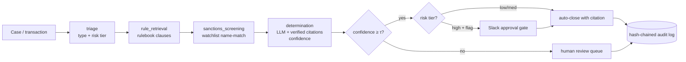

# fsi-compliance-agent

> A compliance-review agent that cites the rule, knows when to abstain, and refuses
> to auto-close a high-risk flag without a human. Built by someone who spent 11 years
> in regulated financial services — and built to survive an examiner reading the audit log.

[](https://github.com/SebAustin/fsi-compliance-agent/actions/workflows/ci.yml)
[](LICENSE)

## The error that matters in compliance

Most "AI for compliance" demos report accuracy. Accuracy is the wrong headline.
In compliance the two errors are not symmetric:

- A **false positive** (flagging a clean transaction) costs an analyst ten minutes.
- A **false negative** (missing a transaction that should have been flagged) is the
  regulatory finding, the consent order, the fine.

This agent is built around that asymmetry. The eval reports false-negative rate as
the headline number. The abstention threshold is calibrated at alpha=0.05 — stricter
than a typical RAG system — because the agent should hand uncertainty to a human
rather than auto-clear a case it isn't sure about.

## How it works

1. **Triage** — classify case type and risk tier (fast model).
2. **Rule retrieval** — find the rulebook clauses that apply (Qdrant + embeddings).
3. **Sanctions screening** — deterministic watchlist name-match (exact + fuzzy). An exact
   hit forces high risk; a near-match goes to human review. Not LLM judgment — a list match.
4. **Determination** — produce a compliant / flag / needs-review decision, with every
   determination citing the specific rule clause. Uncited → invalid.
5. **Abstain** — if confidence is below the calibrated threshold, route to human review.
6. **Approval gate** — high-risk flags go through a Slack approval gate. A compliance
   officer approves or overrides. The agent never auto-closes a high-risk flag.
7. **Audit** — every step is written to a hash-chained, examiner-grade audit log.

### Provider-agnostic, OpenAI by default

The agent runs on **OpenAI or Anthropic** — set `LLM_PROVIDER` (and `EMBED_PROVIDER`).
The default is OpenAI (`gpt-4.1` family + `text-embedding-3-large`).

The citation contract holds either way, but the mechanism differs:

- **Anthropic** uses the native **Citations API**, which returns verifiable char
  offsets into the source document.
- **OpenAI** has no equivalent, so the agent requests quoted spans via structured
  output and **verifies each quote by locating it inside the cited rule clause** —
  a quote the model didn't actually take from the clause is unverifiable and is
  dropped. A determination left with no verifiable citation is rejected
  (`CitationContractError`). This makes "cite or you can't decide" enforceable on
  either provider.



## Quickstart

```bash
git clone https://github.com/SebAustin/fsi-compliance-agent && cd fsi-compliance-agent
uv sync && cp .env.example .env   # set OPENAI_API_KEY (or LLM_PROVIDER=anthropic + key)
make qdrant           # start local Qdrant (docker compose) and wait for ready
make index            # build rulebook index
make calibrate        # fit abstention threshold (alpha=0.05) on labeled cases
make review CASE="Wire transfer of $9,500 to a new payee in a high-risk jurisdiction, structured below the $10k reporting threshold"
make eval             # full eval on 80 cases
make qdrant-stop      # tear down Qdrant when done
```

> Qdrant runs in Docker via [`docker-compose.yml`](docker-compose.yml); its data persists
> in a named volume across restarts. `make test` needs neither Qdrant nor API keys.

> **No external services?** The agent degrades gracefully for local development:
> with `SLACK_BOT_TOKEN` empty the approval gate runs in dry-run mode, and the test
> suite mocks every network boundary (Anthropic, Voyage, Qdrant, Slack) so
> `make test` runs fully offline.

## Eval results (v0.1.0, 100 labeled cases)

Measured on all 100 labeled cases (incl. 20 sanctions hits / near-misses) with
`LLM_PROVIDER=openai` (`gpt-4.1` + `text-embedding-3-large`):

| Metric | Target | v0.1.0 |
|---|---|---|
| **False-negative rate** (missed flags) | ≤ 0.03 | **0.00** |
| Determination accuracy (auto-decided) | ≥ 0.85 | **1.00** |
| Citation coverage | 1.00 | **1.00** |
| Abstention rate | report | **5%** |
| High-risk flags routed to approval | report | **64** |
| Citation-contract failures (excluded) | report | **0** |
| Resolution quality (LLM judge) | report | **0.98** |

**Read these honestly.** The 100 cases are the **design / calibration set**, not a
held-out test set — the rules and prompts were tuned against them, so accuracy is
in-distribution and 1.00 should be read as "no regressions on the known set," not a
generalization claim. A held-out split is tracked as future work. Accuracy is
conditional on the 95 auto-decided cases (100 − 5 abstained). Zero contract failures
this run (the earlier two PEP cases are now cited after the retrieval-recall fix).

The headline that matters: **false-negative rate 0.00** — including the
layered-structuring case that a "below-threshold" clearance clause briefly caused the
agent to auto-clear. Flag-dominance now makes a triggered prohibition override any
clearance, so structuring is flagged, not cleared.

## A note on the data

The rulebook is **synthetic and originally authored** — 46 rules in an AML/BSA-style
structure (reporting thresholds, structuring, sanctions & name-match screening, PEP
handling, beneficial-ownership, plus 5 clearance / safe-harbor clauses so a *cleared*
case can also cite the rule it was evaluated against). The sanctions watchlist (16
fictional parties) is likewise synthetic. None of it is copied from any real regulation
or list. The 100 labeled cases are synthetic. This keeps the repo fully shareable while
exercising the same logic a real rulebook would.

## Repository layout

```
src/compliance_agent/
  state.py        CaseState + pydantic models (the contracts)
  graph.py        LangGraph StateGraph wiring
  config.py       pydantic-settings configuration
  nodes/          triage, rule_retrieval, sanctions_screening, determination, abstain, approval_gate, close
  rulebook/       indexer + rules.jsonl (46 synthetic rules) + watchlist.jsonl (16 parties)
  sanctions.py    deterministic exact + fuzzy watchlist name-match
  audit/          hash-chained audit log + per-case Markdown examiner report
  api/server.py   FastAPI: /review /approvals /slack/interactivity /audit
evals/            run_eval.py (false-negative rate is the headline), judge.py, cases.jsonl
scripts/          build_index.py, calibrate.py, review.py
docs/             architecture, rulebook design, examiner notes
```

## Sources

1. Anthropic. *Citations API documentation.* docs.anthropic.com, 2025.
2. Yadkori et al. *Mitigating LLM Hallucinations via Conformal Abstention.* arXiv 2405.01563, 2024.
3. Anthropic. *Building effective agents.* anthropic.com, 2024.

## License

MIT — see [LICENSE](LICENSE).
